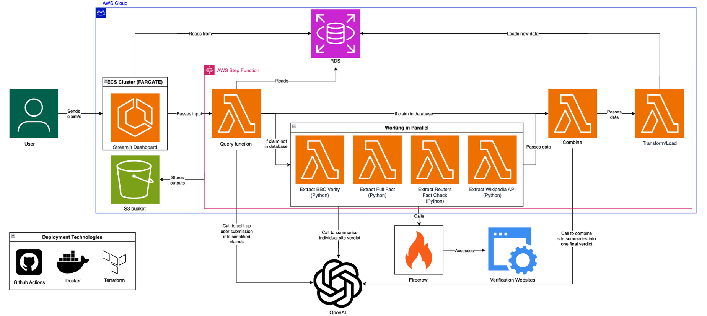

# Disinformation Verifier


A tool for journalists to check claims against trusted fact-checking sources. You paste in a claim, headline or article text and it returns a verdict, a plain English explanation and the sources it used. Every result is stored, so a claim that has already been checked is answered from the database instead of being checked again.

## Contents

- [The problem](#the-problem)
- [What it does](#what-it-does)
- [Project status](#project-status)
- [Architecture](#architecture)
- [Trusted sources](#trusted-sources)
- [Tech stack](#tech-stack)
- [Repository structure](#repository-structure)
- [Getting started](#getting-started)
- [Environment variables](#environment-variables)
- [Testing and code quality](#testing-and-code-quality)
- [Security](#security)
- [Known issues and next steps](#known-issues-and-next-steps)
- [Team](#team)

Each folder has its own README: [database](database/README.md), [frontend](frontend/README.md), [pipeline](pipeline/README.md), [terraform](terraform/README.md).

## The problem

Journalists and desk editors have to verify claims quickly, usually under deadline. Checking a claim by hand means searching several fact-checking outlets (BBC Verify, Reuters and others), which takes roughly 15 to 45 minutes per claim. When news first breaks there is a real risk of publishing something that is missing context or wrongly attributed. Most existing fact-check tools are built for researchers and need an open dataset or API to be queried.

This project puts the checking in one place and gives a structured answer. Because results are stored, colleagues in the same newsroom don't repeat the same search.

## What it does

1. Extracts the individual claims from the text and drops opinions and vague statements.
2. Compares each claim with the claims already in the database using vector similarity. If there is a close match, the earlier result is returned.
3. For new claims, searches Reuters Fact Check, BBC Verify, Full Fact and Wikipedia, and uses an LLM to compare the claim with what each outlet says.
4. Combines the results into one verdict, a summary, a confidence score and a list of sources.
5. Saves everything so it appears in the history page.

Each claim gets one of four verdicts:

| Verdict | Meaning |
|---|---|
| Supported | Trusted sources back the claim |
| Contradicted | Trusted sources contradict the claim |
| Mixed / Missing Context | Partly true, or true but misleading without context |
| Unclear / Not enough evidence | No matching or conclusive evidence found |

Claims are also given a topic tag (for example Politics UK or Healthcare) and a disinformation technique (for example Cherry Picking, Outdated Content or None).

The dashboard has four views: Claim Verification, Top Disproven Claims, Verification Logs, Outlet Analysis and Claim Analysis.


## Architecture




How the parts fit together:

1. The user submits text in the Streamlit dashboard, which runs on ECS Fargate.
2. The extract Lambda pulls out the claims, embeds each one and searches PostgreSQL (pgvector) for a similar claim. A cosine similarity of 0.8 or higher counts as a match and the stored result is reused.
3. New claims go to the verify Lambda. There is one run per outlet (Reuters Fact Check, BBC Verify, Full Fact, Wikipedia) and the runs are meant to happen in parallel.
4. The transform / load Lambda groups the verdicts by claim, writes an overall summary and confidence score, cleans the data and inserts it into PostgreSQL.
5. The dashboard reads from PostgreSQL to show history, disproven claims and outlet analytics.

Some of the reasons for the main choices, from the proposal:

- Lambda is pay per use and scales on its own. One function per outlet makes it easy to add a new source.
- ECS Fargate avoids paying for an always-on EC2 instance.
- PostgreSQL was chosen over DynamoDB and S3. DynamoDB has no joins and is expensive to scan, and S3 needs Athena to query. Postgres gives relational links between claims, sources, outlets and verdicts, which suits the evidence trail, and pgvector handles the similarity search. An unused DynamoDB table is still in the Terraform from the earlier design.
- Streamlit was quick to build a usable dashboard with.

## Trusted sources

| Outlet | Why it was chosen |
|---|---|
| Reuters Fact Check | Market leading fact-checker, a good baseline |
| BBC Verify | A news outlet with access to more advanced technical verification |
| Full Fact | Specialises in political and quantifiable claims such as statistics and policy |
| Wikipedia API | Broad consensus built up from many contributors over time |

Using four different sources reduces the bias of depending on any one of them.

## Tech stack

| Layer | Technology |
|---|---|
| Language | Python 3.12 |
| Dashboard | Streamlit, Plotly, pandas |
| Pipeline | AWS Lambda (container images) |
| Dashboard hosting | AWS ECS Fargate, ECR |
| Database | PostgreSQL 17 on RDS, pgvector, psycopg2 |
| LLM and embeddings | OpenAI SDK against an OpenAI-compatible endpoint, Pydantic structured outputs |
| Web search | Firecrawl |
| Article extraction | newspaper3k |
| Infrastructure | Terraform (Terraform Cloud backend) |
| Testing | pytest, pytest-mock, pytest-cov, pylint |

## Repository structure

```
.
├── database/                  Postgres schema and seed data
├── frontend/                  Streamlit dashboard
│   ├── app.py
│   ├── database_conns/
│   ├── visual_components/
│   └── tests/
├── pipeline/
│   ├── extract_claims/        Lambda 1
│   ├── verify_claims/         Lambda 2
│   ├── transform_load/        Lambda 3
│   ├── url_extract.py
│   ├── link_verifier.py
│   └── query.py
├── terraform/                 AWS infrastructure
└── .github/ISSUE_TEMPLATE/ticket.md
```

## Getting started

### Prerequisites

- Python 3.12
- PostgreSQL with the [pgvector](https://github.com/pgvector/pgvector) extension, either local or the RDS instance
- An API key and base URL for an OpenAI-compatible endpoint
- A [Firecrawl](https://www.firecrawl.dev/) API key
- Docker to build images, and Terraform with AWS credentials to deploy

### 1. Clone and set up a virtual environment

```bash
git clone <repo-url>
cd <repo-folder>
python3.12 -m venv .venv
source .venv/bin/activate
```

### 2. Create the database

Warning: `schema.sql` starts with `DROP DATABASE disinformation;`. It deletes any existing database with that name.

```bash
# local
psql postgres -f database/schema.sql

# AWS RDS
psql -h <db_hostname> -p <db_port> -U <db_username> postgres -f database/schema.sql
```

### 3. Set environment variables

Create `frontend/.env`:

```env
DB_HOST=localhost
DB_PORT=5432
DB_NAME=disinformation
DB_USER=<your user>
DB_PASSWORD=<your password>
DASHBOARD_PASSWORD=<choose a password>
```

The Lambdas get their variables from the Lambda environment, which Terraform sets. To run one locally, put them in a `.env` file in that Lambda's folder. The full list is in [Environment variables](#environment-variables).

### 4. Run the dashboard

```bash
pip install -r frontend/requirements.txt
cd frontend
streamlit run app.py
```

Open http://localhost:8501 and log in with `DASHBOARD_PASSWORD`.

### 5. Try the pipeline locally

Each Lambda is a normal Python function, so you can call it directly from inside its folder:

```bash
cd pipeline/extract_claims
pip install -r requirements.txt
python -c "from handler_extract_claims import handler; print(handler({'user_text': 'The unemployment rate fell to 3.1% last year.'}, None))"
```

The input and output of each Lambda is described in [pipeline/README.md](pipeline/README.md).

### 6. Deploy

See [terraform/README.md](terraform/README.md).

## Environment variables

| Variable | Used by | Purpose |
|---|---|---|
| `OPENAI_API_KEY` | extract, verify, transform_load | API key for the LLM and embeddings endpoint |
| `OPENAI_BASE_URL` | extract, verify, transform_load | Base URL of the endpoint (required, no default) |
| `API_KEY` | verify | Firecrawl API key |
| `DB_HOST`, `DB_PORT`, `DB_NAME`, `DB_USER`, `DB_PASSWORD` | extract Lambda, frontend | Postgres connection |
| `DATABASE_IP`, `DATABASE_PORT`, `DATABASE_NAME`, `DATABASE_USERNAME`, `DATABASE_PASSWORD` | transform_load (`load.py`), `query.py` | Postgres connection, with different names |
| `DASHBOARD_PASSWORD` | frontend | Dashboard login password |

`.env` files and `*.tfvars` are in `.gitignore`. Don't commit them.

## Testing and code quality

```bash
pip install -r pipeline/requirements.txt
cd pipeline
pytest
pytest --cov
pylint <path-to-module>
```

- Pipeline tests cover the load formatters, the transform functions, URL extraction and URL/SSL checks.
- `test_link_verifier.py` makes real network calls, so it needs internet access.
- The frontend tests in `frontend/tests/test_frontend.py` are out of date and won't run. See [frontend/README.md](frontend/README.md).

Standards from the ticket template: where it applies, aim for test coverage over 80% and a pylint score over 8.0. Raise work as a ticket using `.github/ISSUE_TEMPLATE/ticket.md`, which asks for a description, user stories and acceptance criteria.

## Security

Planned approach: least privilege IAM roles, no committed credentials, validated inputs, and keeping scraped content separate from LLM instructions.

Already in place:

- `.gitignore` covers `.env*`, `*.tfvars`, Terraform state and keys.
- Each Lambda and the ECS service has its own IAM role. The Lambda roles only allow CloudWatch Logs, plus VPC access for the extract Lambda.
- LLM calls use Pydantic structured outputs with fixed lists of allowed values. Scraped text goes in the user message, not the system message.

## Next steps

Extension ideas from the brief:

- Monitoring mode, where users define a topic or keyword and the system regularly ingests related articles and extracts candidate claims.
- Image or screenshot input.
- More verification sources.

## Team

Emily Cassin, Suvo Baidya, Sophie Lin and James Marsden.