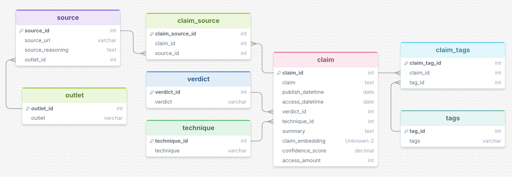

# Database

This folder has the PostgreSQL schema for the Disinformation Verifier. `schema.sql` creates the database and tables and adds the seed data (topic tags, outlets, verdicts and techniques).

The database is the only data store in the project:

- The pipeline writes checked claims, their sources and their embeddings to it.
- The extract Lambda searches it for similar claims that were already checked.
- The dashboard reads it for history, disproven claims and outlet analytics.

## Requirements

- PostgreSQL 15 or later. The RDS instance in Terraform runs Postgres 17.
- The [pgvector](https://github.com/pgvector/pgvector) extension. It is available on Amazon RDS for PostgreSQL. Locally you may need to install it (for example `brew install pgvector`) or use the `pgvector/pgvector` Docker image.
- The `psql` client. The script uses the `\c` meta-command, so it has to be run with `psql`.

## Setup

Warning: the script starts with `DROP DATABASE disinformation;` and then `CREATE DATABASE disinformation;`. If a `disinformation` database already exists, all its data is deleted.

Local:

```bash
psql postgres -f schema.sql
```

AWS RDS:

```bash
psql -h <db_hostname> -p <db_port> -U <db_username> postgres -f schema.sql
```

The script connects to the default `postgres` database, creates `disinformation`, switches to it, enables the `VECTOR` extension, creates the tables and inserts the seed data. After that, set `DB_NAME=disinformation` in the application settings. The variable names are listed in the [root README](../README.md#environment-variables).

The seed inserts use `ON CONFLICT ... DO NOTHING`, so those parts can be run again safely.

## Data model



There are eight tables. `claim` is the main one. `verdict`, `technique`, `tags` and `outlet` are lookup tables. `claim_tags` and `claim_source` link claims to their tags and sources, and each `source` belongs to an `outlet`.

Relationships:

- Each claim has one verdict and one technique (`claim.verdict_id`, `claim.technique_id`).
- A claim can have many tags, through `claim_tags`.
- A claim can have many sources, through `claim_source`.
- Each source belongs to one outlet (`source.outlet_id`).

### Tables

| Table | Columns | Purpose |
|---|---|---|
| `claim` | `claim_id`, `claim`, `publish_datetime`, `access_datetime`, `verdict_id`, `technique_id`, `summary`, `claim_embedding`, `confidence_score`, `access_amount` | One row per checked claim. This is the main table. |
| `verdict` | `verdict_id`, `verdict` | Lookup table: Supported, Contradicted, Mixed / Missing Context, Unclear / Not enough evidence. |
| `technique` | `technique_id`, `technique` | Lookup table of 16 disinformation techniques, for example Deepfake, Cherry Picking, Outdated Content and None. |
| `tags` | `tag_id`, `tags` | Lookup table of 49 topic tags, for example Politics UK, Healthcare, Climate Change and Other. |
| `claim_tags` | `claim_tag_id`, `claim_id`, `tag_id` | Links claims to topic tags (many to many). |
| `outlet` | `outlet_id`, `outlet` | Lookup table of the four outlets: Reuters Fact Check, BBC Verify, Full Fact, Wikipedia API. |
| `source` | `source_id`, `source_url`, `source_reasoning`, `outlet_id` | An article or URL used as evidence, with the LLM's reasoning for that source and the outlet it came from. |
| `claim_source` | `claim_source_id`, `claim_id`, `source_id` | Links claims to their sources (many to many). This is the evidence trail. |

### Columns on `claim`

| Column | Notes |
|---|---|
| `claim_embedding` | A 1536 dimension vector from `text-embedding-3-small`. Used for cosine similarity search. If the embedding model changes, this size has to change too. |
| `confidence_score` | Between 0 and 1. It reflects how much the outlets agree. |
| `publish_datetime`, `access_datetime` | Both default to the time the row is inserted and can't be in the future. The pipeline doesn't set `publish_datetime`, so in practice it is the time the claim was first stored. |
| `access_amount` | Starts at 1. Goes up each time a new submission matches this claim. |

The combination of `claim`, `publish_datetime` and `access_datetime` is unique, which stops exact duplicate inserts. `claim_tags` and `claim_source` each have a unique pair so the same link can't be stored twice. `verdict_id` and `technique_id` on `claim` can't be empty, so every stored claim needs both.

### ERD and schema.sql

The ERD image and `schema.sql` don't match in a few places. `schema.sql` is the file that gets run and the pipeline code was written against it, so check which one is right and update the other.

| Item | ERD | schema.sql |
|---|---|---|
| Primary key of `claim_tags` | `claim_tag_id` | `claim_tags_id` |
| Name column in `tags` | `tags` | `tag` |
| `publish_datetime` and `access_datetime` | date | TIMESTAMP |
| `confidence_score` | decimal | FLOAT |
| `source_url` | varchar | TEXT |

The `tags` column name matters most. `load.py` reads `tag` from the `tags` table, and `frontend/database_conns/fetch_data.py` uses both `tg.tag` and `tg.tags`.

## How the application uses it

Duplicate detection (extract Lambda): a new claim is embedded and compared with stored claims using pgvector's cosine distance operator (`<=>`). Similarity is `1 - distance`. The closest claim with similarity of 0.8 or more counts as a match. The query also updates `access_datetime` and adds 1 to `access_amount` on the matched row, and the earlier verdict and summary are returned.

```sql
SELECT claim_id, claim, 1 - (claim_embedding <=> :query_embedding) AS similarity
FROM claim
WHERE 1 - (claim_embedding <=> :query_embedding) >= 0.8
ORDER BY claim_embedding <=> :query_embedding
LIMIT 1;
```

Loading (transform / load Lambda): new claims go into `claim`, then their tags into `claim_tags`, their evidence into `source`, and the pairings into `claim_source`. Verdict, technique, tag and outlet names are turned into IDs using the lookup tables. Rows with values that aren't in the lookups are skipped and a warning is logged.

Dashboard: reads `claim` joined to `verdict`, `technique`, `claim_tags` / `tags` and `claim_source` / `source` / `outlet`.

## Example queries

Recent claims with verdict, technique and outlets:

```sql
SELECT c.claim, v.verdict, t.technique,
       STRING_AGG(DISTINCT o.outlet, ', ') AS outlets,
       c.access_datetime
FROM claim c
JOIN verdict v      ON v.verdict_id = c.verdict_id
JOIN technique t    ON t.technique_id = c.technique_id
LEFT JOIN claim_source cs ON cs.claim_id = c.claim_id
LEFT JOIN source s        ON s.source_id = cs.source_id
LEFT JOIN outlet o        ON o.outlet_id = s.outlet_id
GROUP BY c.claim_id, v.verdict, t.technique
ORDER BY c.access_datetime DESC
LIMIT 20;
```

Claims that have been submitted most often:

```sql
SELECT claim, access_amount FROM claim ORDER BY access_amount DESC LIMIT 10;
```

## Changing the reference data

The topic tags, techniques, verdicts and outlets exist in two places: the seed data in `schema.sql`, and the Python lists and `Literal` types that limit the LLM output and validate records (`extract_models.py`, `summary_models.py`, `verify_models.py` and `transform.py`). If you add or rename a value, change both, otherwise the pipeline will reject it or drop the row.
